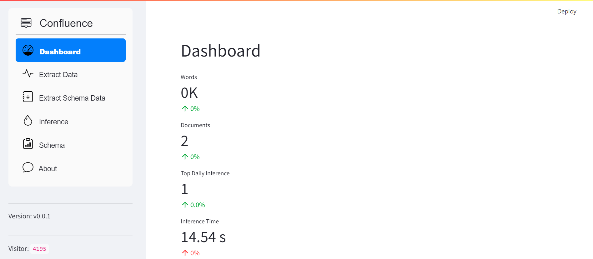
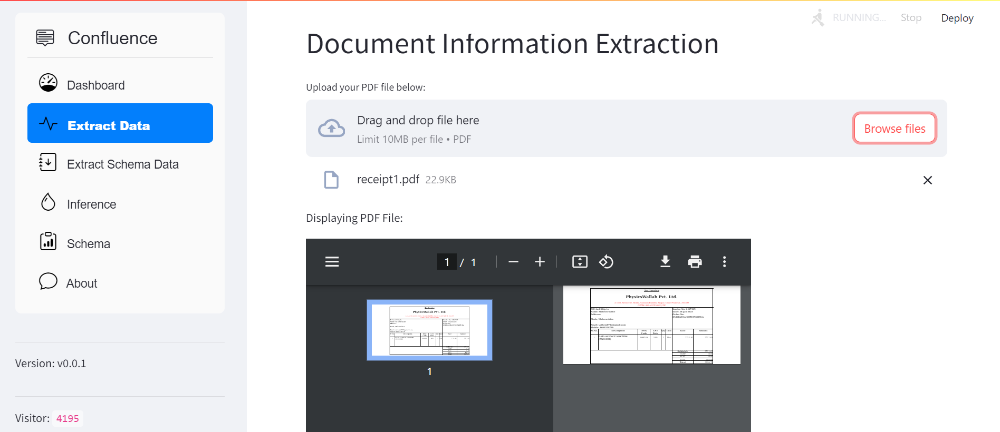
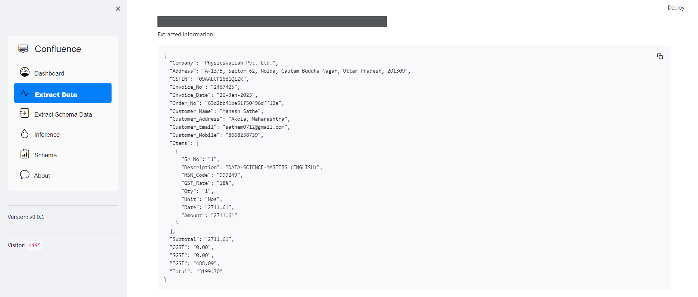
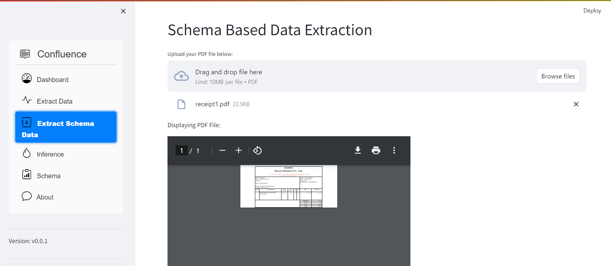
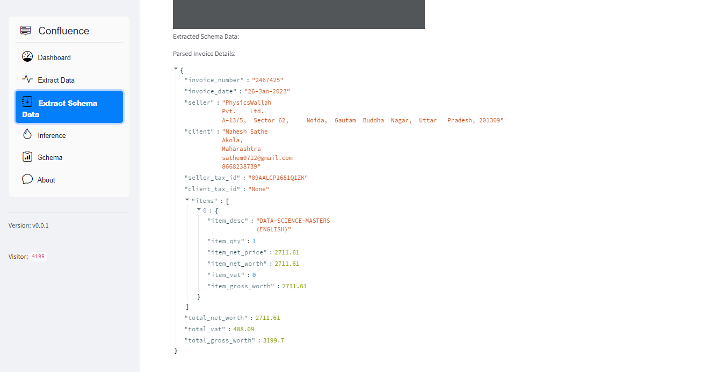
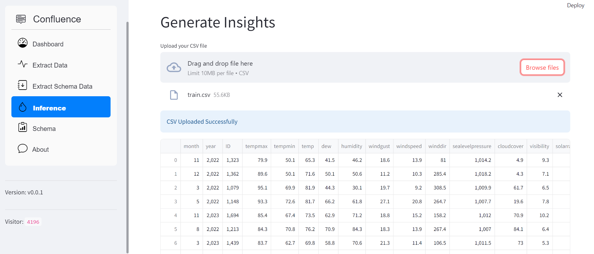
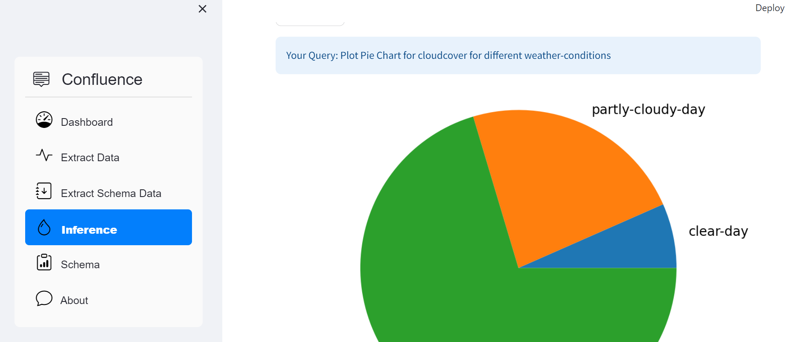
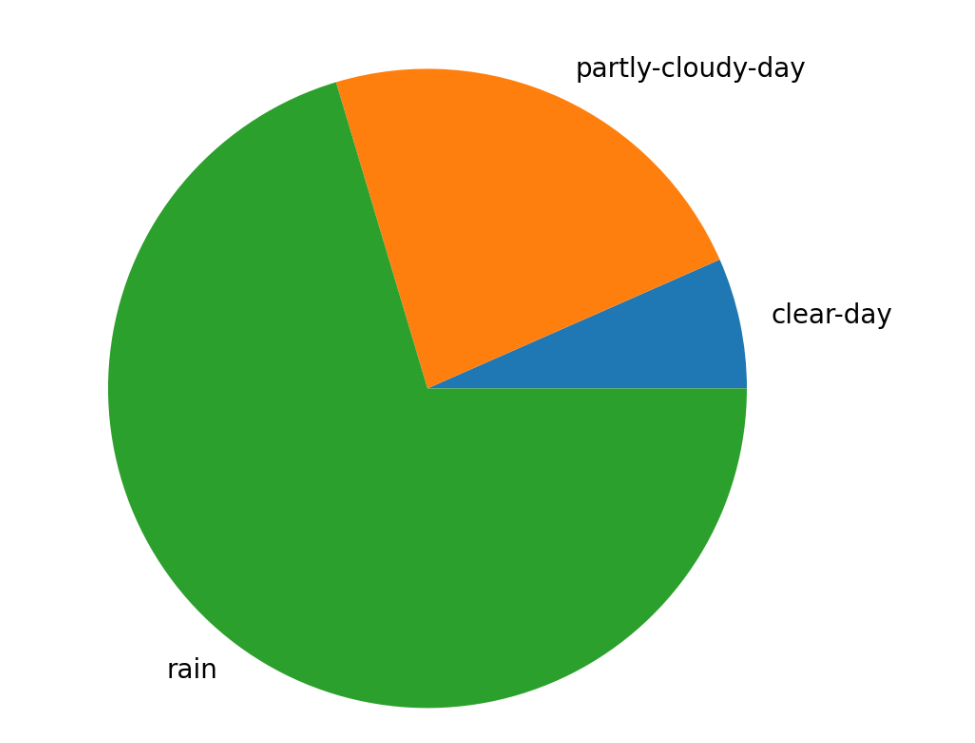

# AI-Powered PDF to Data Converter

Convert PDF files into structured data using AI-powered extraction and generate insights from the extracted data.

## Overview

This project provides a solution for converting PDF files into structured data formats, such as JSON, using advanced AI techniques. It offers various functionalities including generalized data extraction, schema-based extraction, and generating insights from the extracted data.

## Functionalities

1. **Generalized Data Extraction**: Extract all data from PDF files in JSON format.
2. **Schema-Based Extraction**: Extract data based on predefined schemas for specific document types.
3. **Generate Insights**: Upload the extracted data in CSV format and generate insights by plotting graphs based on user queries.

## Dependencies

The project utilizes the following libraries and tools:

- **Langchain**: For AI-powered PDF data extraction.
- **Gemini-pro**: For converting extracted data into JSON format.
- **Pydantic**: For schema-based data extraction.
- **Streamlit**: For building interactive web applications.
- **PandasAi**: For data Visualization.
- **GROQ with Mixtral**: For getting query based insights from .csv data.

## Screenshots

1. Dashboard
   

2. Extract Data
   

3. Extracted Data Output
   

4. Schema-Based Data Extraction
   

5. Schema-Based Data Output
   

6. Generate Insights
   

7. Generated Insights Output
   

8. Pie Chart
   

## How to Run

1. Clone the repository:

   ```bash
   git clone https://github.com/maheshsathe07/AI-powered-PDF-to-Data-Converter.git
   ```

2. Navigate to the project directory:

   ```bash
   cd src
   ```
   
3. Install the required dependencies:

   ```bash
   pip install -r requirements.txt
   ```


4. Run the Streamlit app:

   ```bash
   streamlit run main.py
   ```

5. Access the app in your browser at `http://localhost:8501`.

## Contributors

- [Mahesh Sathe](https://github.com/maheshsathe07)
- [Atharva Shinde](https://github.com/auth-02)
- [Prem Shejole](https://github.com/shejoleprem)
- [Bhushan Sangle](https://github.com/Goddivinein)


## License

This project is licensed under the MIT License - see the [LICENSE](LICENSE) file for details.
